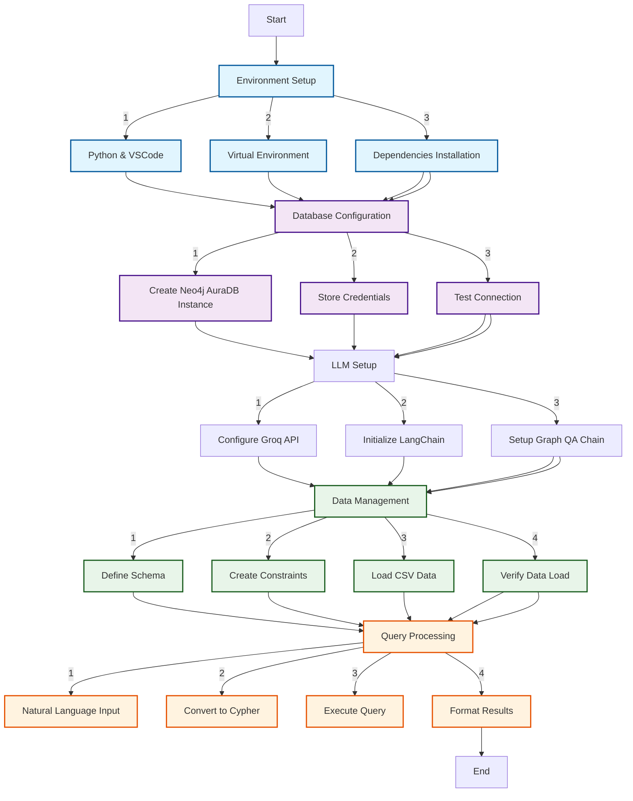

## Neo4j Graph Database Setup and Integration Guide
#### System Architecture Flowchart


---

## Technical Components
### Core Technologies
- Python 3.x
- Neo4j DB (Cloud)
- Groq LLM API
- LangChain Framework
- Visual Studio Code

### Required Python Packages
```python
langchain==0.1.0
langchain-community==0.0.13
langchain-groq==0.0.3
neo4j==5.14.1
python-dotenv==1.0.0
```
## Environment Setup Instructions
```python
# Create virtual environment
python -m venv venv

# Activate virtual environment (Windows)
.\venv\Scripts\activate

# Install dependencies
pip install -r requirements.txt
```

## Configuration Settings

```python
# .env file structure
NEO4J_URI="neo4j+s://xxxxx.databases.neo4j.io"
NEO4J_USERNAME="neo4j"
NEO4J_PASSWORD="your-password"
GROQ_API_KEY="gsk_xxxxxx"
```

 
## Implementation Steps
1. Environment Setup

    - Install Python 3.x
    - Setup VSCode with Python extension
    - Create virtual environment
    - Install required packages
2. Neo4j Configuration

    - Create Neo4j AuraDB instance
    - Save connection credentials
    - Test database connection
    - Create constraints and indexes
3. LLM Integration

    - Setup Groq account
    - Configure API access
    - Initialize LLM client
    - Test query processing
4. Data Pipeline

    - Prepare CSV data
    - Define schema structure
    - Create load queries
    - Execute data import
5. Query System

    - Initialize GraphCypherQAChain
    - Configure query templates
    - Implement error handling
    - Format response output