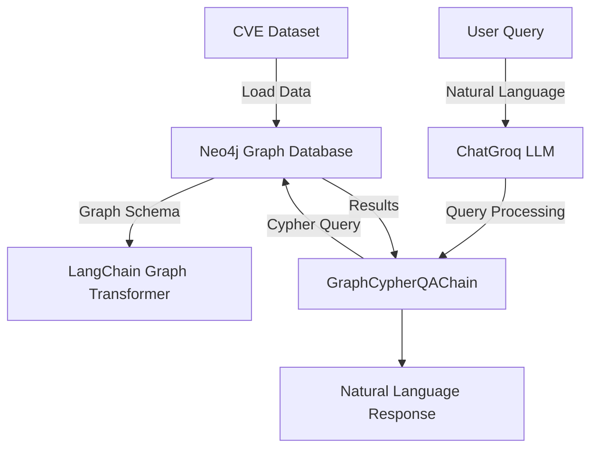

## Overview
This system integrates a CVE dataset into a Neo4j graph database, processes user queries through a LangChain-based architecture using a Gemma2-9b-It language model, and generates natural language responses. The system architecture includes components for data integration, graph schema setup, query processing, and response generation.

## Tech Stack
- **Database**: Neo4j Graph Database
- **Programming Language**: Python
- **Key Libraries**:
  - LangChain
  - LangChain Community
  - LangChain Groq
  - LangChain Experimental
  - Neo4j Python Driver
- **Model**: Gemma2-9b-It (via Groq)
- **Environment**: Google Colab with TPU support

## System Architecture

## Workflow Steps
1. Data Integration
   - Load CVE dataset into Neo4j
   - Create nodes for vulnerabilities and protocols
   - Establish relationships between entities

2. Graph Schema Setup

   - Define node properties (CVE, Protocol)
   - Configure relationship types
   - Set up property constraints and indices

3. Query Processing

   - Accept natural language queries
   - Transform to Cypher queries via LLM
   - Execute against graph database
   - Convert results to human-readable format

4. Response Generation

   - Process graph query results
   - Generate natural language responses
   - Format and present information

### Data Model
#### Node Types
1. CVE Node

   - Properties:
      - id (String)
      - cvss_v2 (Float)
      - cvss_v3 (Float)
      - severity (String)
      - impact (String)
      - operating_system (String)
      - software_component (String)
      - version (String)
      - vendor (String)

2. Protocol Node

   - Properties:
      - name (String)

#### Relationships
- `AFFECTS_PROTOCOL`: Links CVE nodes to Protocol nodes